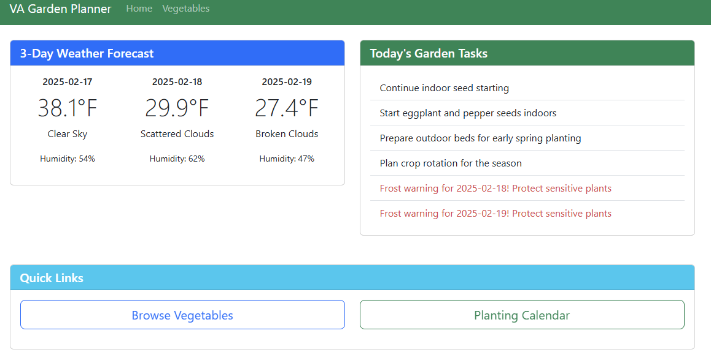

# Virginia Garden Planner

A Flask-based web application designed specifically for Virginia Zone 7A gardeners. This application helps gardeners plan their vegetable gardens, track planting windows, and monitor weather conditions.

## Features

1. **Vegetable Database**
   - Comprehensive list of vegetables suitable for Virginia Zone 7A
   - Detailed information for each vegetable:
     * Sowing type (Direct sow or transplant)
     * Days to harvest
     * Plant spacing
     * Seed planting depth
     * Sowing windows
     * Harvest windows

2. **Weather Integration**
   - 3-day forecast for zip code 23832
   - Temperature, conditions, and humidity information
   - Automatic frost warnings when temperatures drop below 32°F

3. **Daily Task Recommendations**
   - Month-specific gardening tasks
   - Indoor seed starting reminders
   - Transplanting window notifications
   - Weather-based alerts (e.g., frost warnings)
   - Seasonal maintenance tasks

## Installation

1. Clone the repository:
   ```bash
   git clone https://github.com/toquothty/virginia-garden-planner.git
   cd virginia-garden-planner
   ```

2. Create and activate a virtual environment:
   ```bash
   python -m venv venv
   .\venv\Scripts\activate  # Windows
   source venv/bin/activate  # Linux/Mac
   ```

3. Install dependencies:
   ```bash
   pip install flask requests python-dotenv
   ```

4. Create a `.env` file in the root directory and add your OpenWeather API key:
   ```
   OPENWEATHER_API_KEY='your_api_key_here'
   ```

5. Initialize the database:
   ```bash
   python init_db.py
   ```

## Running the Application

1. Start the Flask development server:
   ```bash
   python app.py
   ```

2. Open your web browser and navigate to:
   ```
   http://localhost:5000
   ```

## Project Structure

```
virginia-garden-planner/
├── app.py                 # Main Flask application
├── init_db.py            # Database initialization script
├── garden.db             # SQLite database
├── .env                  # Environment variables
├── static/
│   ├── css/             # CSS styles
│   ├── js/              # JavaScript files
│   └── images/          # Image assets
├── templates/            # HTML templates
│   ├── base.html        # Base template
│   ├── index.html       # Homepage
│   ├── vegetables.html  # Vegetable list
│   └── vegetable_detail.html  # Individual vegetable pages
└── docs/                # Documentation and screenshots
```

## Screenshots

### Homepage
The homepage displays the current 3-day weather forecast for zip code 23832 and today's gardening tasks. Weather-based alerts, such as frost warnings, are automatically displayed when temperatures drop below 32°F.

[Screenshot to be added: Homepage showing weather forecast and daily tasks]

### Vegetables List
The vegetables page shows a grid of all vegetables suitable for Virginia Zone 7A, with basic information about each vegetable including sow type and days to harvest.

[Screenshot to be added: Grid view of vegetables with images and basic information]

### Vegetable Detail
Each vegetable has a detailed page showing comprehensive growing information, including:
- Sowing type and seed depth
- Plant spacing
- Days to harvest
- Sowing and harvest windows
- Growing tips

[Screenshot to be added: Detailed view of a vegetable with all growing information]

### Adding Your Own Screenshots

To add screenshots to this documentation:

1. With the application running (`python app.py`), visit each page:
   - Homepage: `http://localhost:5000/`
   - Vegetables List: `http://localhost:5000/vegetables`
   - Vegetable Detail: Click any vegetable card

2. Take screenshots of each page (Windows: Win+Shift+S, Mac: Cmd+Shift+4)

3. Save the screenshots in the `docs` directory:
   ```
   docs/
   ├── homepage.png       # Weather and tasks view
   ├── vegetables.png     # Grid of vegetables
   └── vegetable-detail.png  # Individual vegetable information
   ```

4. Update this README by replacing the placeholder text with your screenshots:
   ```markdown
   
   ```

## Customization

1. **Adding New Vegetables**
   - Edit the `VEGETABLES` list in `init_db.py`
   - Run `python init_db.py` to update the database

2. **Modifying Task Recommendations**
   - Edit the `get_daily_tasks()` function in `app.py`
   - Tasks are organized by month with weather-based alerts

3. **Changing Location**
   - Update the `ZIP_CODE` variable in `app.py`
   - Weather forecasts will automatically update for the new location

## Contributing

1. Fork the repository
2. Create a feature branch
3. Commit your changes
4. Push to the branch
5. Create a Pull Request

## License

This project is licensed under the MIT License - see the LICENSE file for details.
